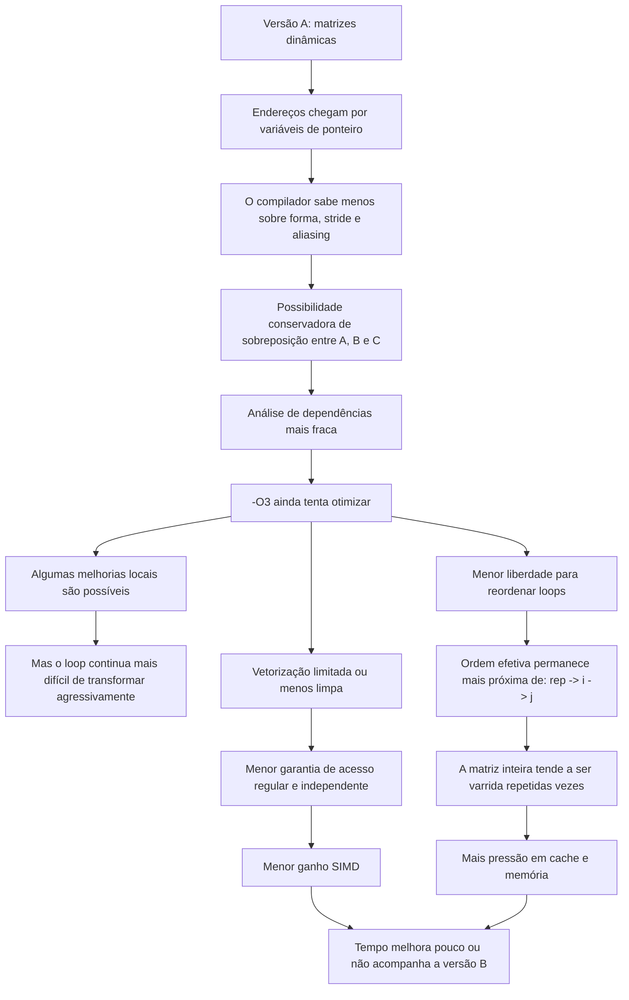
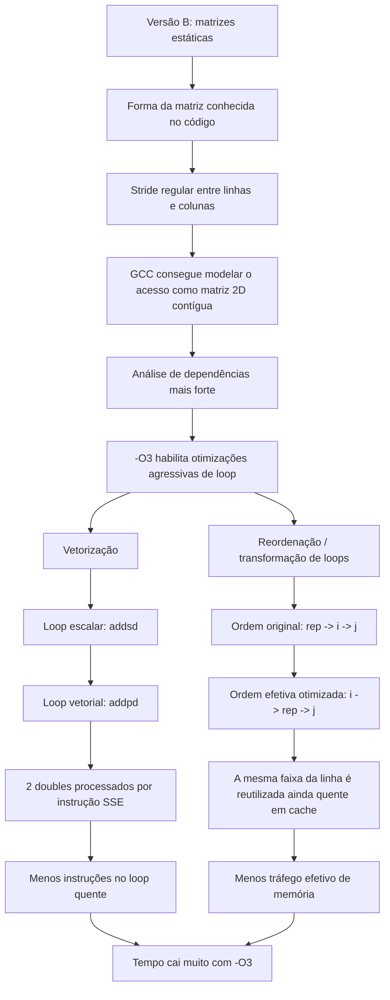

# Por que a versão com `[]` dispara com `-O3`?

Pergunta respondida:

> Fiz 2 versões do mesmo programa: soma lotes da matriz `A` e `B` e armazena em `C`.
>
> No programa A, as matrizes foram criadas via ponteiros; no B, com notação de `[]`.
>
> Ambos executam em tempo similar, mas adicionando `-O3`, o programa B executa muito mais rápido que o A.
>
> Por quê?

Em C, `a[i][j]` também vira aritmética de endereço. A diferença é que, na versão B, o tipo da matriz carrega mais informação para o compilador: tamanho fixo, stride conhecido, acesso contíguo por linha e três objetos globais distintos. Com isso o GCC consegue provar mais coisas e aplicar otimizações agressivas de loop. Na versão por ponteiros, principalmente sem `restrict`, alinhamento explícito e stride fixo visível, o compilador precisa ser mais conservador.

---

## Ambiente observado

Ambiente informado para a execução:

```text
ISA/SO:      x86_64, Ubuntu 24.04 LTS
CPU:         Intel Core i7 Raptor Lake
Workload:    SIZE = 10000
Threads:     10
Repetições:  100
```

---

> Há uma versão principal com alocação estática em `src/matrix_static.c`, com matrizes globais 2D:

```c
#define SIZE 10000

double matrixA[SIZE][SIZE];
double matrixB[SIZE][SIZE];
double result_matrix[SIZE][SIZE];
```

O núcleo medido é:

```c
void *matrixAdd(void *arg)
{
    range *r = (range *)arg;

    for (int rep = 0; rep < 100; rep++) {
        for (unsigned long long i = 0; i < SIZE; i++) {
            for (unsigned long long j = r->start; j < r->end; j++) {
                result_matrix[i][j] = matrixA[i][j] + matrixB[i][j];
            }
        }
    }

    return NULL;
}
```

---

> Há também outra versão usando alocação dinâmica em `src/matrix_dynamic.c`, com ponteiros globais para acessar os elementos posteriormente alocados:

```c
#define SIZE 10000

double *matrixA;
double *matrixB;
double *result_matrix;

int main() {
    matrixA       = (double *)malloc((size_t)SIZE * SIZE * sizeof(double));
    matrixB       = (double *)malloc((size_t)SIZE * SIZE * sizeof(double));
    result_matrix = (double *)malloc((size_t)SIZE * SIZE * sizeof(double));
```

O núcleo medido é:

```c
void *matrixAdd(void *arg) {
    range *r = (range *)arg;
    for (int rep = 0; rep < 100; rep++) {
        for (unsigned long long i = 0; i < SIZE; i++) { 
            for (unsigned long long j = r->start; j < r->end; j++) {
                result_matrix[i * SIZE + j] = matrixA[i * SIZE + j] + matrixB[i * SIZE + j];
            }
        }
    }
    return NULL;
}
```

---

## Resultado medido

Logs do repositório:

```text
-O1: Tempo gasto na execucao 6.048366 segundos
-O3: Tempo gasto na execucao 0.404796 segundos
```

Speedup:

$$
\begin{aligned}
S = \frac{T_{O1}}{T_{O3}}
  = \frac{6.048366}{0.404796}
  \approx 14.94
\end{aligned}
$$

Ou seja, a versão `-O3` medida roda cerca de **15x mais rápido**.

---

## O que o `readelf` prova

O `readelf` mostra que a diferença não vem de outro layout no binário. A seção `.bss`, que é onde esses elementos devem estar localizados por serem variáveis globais não estáticas não inicializadas, continua carregando as matrizes globais gigantes:

```text
[26] .bss NOBITS 0000000000004020 003010 8f0d1820 ... WA ... 32
```

Tamanho:

$$
\begin{aligned}
  0x8f0d1820 = 2\,400\,000\,032\ \text{bytes}
\end{aligned}
$$

Três matrizes de `double`:

$$
\begin{aligned}
  3 \cdot 10000 \cdot 10000 \cdot 8
  = 2\,400\,000\,000\ \text{bytes}
\end{aligned}
$$

Os 32 bytes restantes são alinhamento/objetos auxiliares. Então a causa não é “o binário ter menos matriz” nem `readelf` indicar outra alocação. O ganho vem do código emitido no `.text`.

---

## Assembly em `-O1`: escalar e varredura completa

No `-O1`, o loop quente usa SSE escalar:

```asm
movsd xmm0, QWORD PTR [rdx+rax*8]
addsd xmm0, QWORD PTR [rdi+rax*8]
movsd QWORD PTR [rsi+rax*8], xmm0
add   rax, 0x1
cmp   rax, QWORD PTR [rcx+0x8]
jb    ...
```

Pontos importantes:

1. `movsd`/`addsd` operam **um `double` por vez**.
2. O limite `r->end` é recarregado no hot path.
3. A repetição externa permanece como no C: faz uma varredura grande, depois volta para a próxima repetição.

Na prática, cada repetição toca quase todo o bloco de memória. Como o conjunto das três matrizes é ~2.4 GB, a próxima repetição não reencontra os mesmos dados ainda quentes em cache.

---

## Assembly em `-O3`: vetorização e troca de loops

No `-O3`, o loop quente muda para SSE vetorial:

```asm
movupd xmm0, XMMWORD PTR [rbx+rax*1]
movupd xmm1, XMMWORD PTR [r11+rax*1]
addpd  xmm0, xmm1
movups XMMWORD PTR [r9+rax*1], xmm0
add    rax, 0x10
cmp    rax, r10
jne    ...
```

Pontos importantes:

1. `addpd` soma **dois `double` por instrução**.
2. `rax += 0x10` avança 16 bytes, isto é, dois `double`.
3. O compilador também reorganizou o ninho: no assembly aparece um contador de linha (`r14`) e, para cada linha/faixa, um contador de repetição (`edx = 100`).

Esse terceiro ponto é o mais forte. O `-O3` não apenas troca `addsd` por `addpd`; ele também muda a ordem efetiva:

```text
-O1 conceitual:
    for rep:
        for i:
            for j:
                C[i][j] = A[i][j] + B[i][j]

-O3 efetivo:
    for i:
        for rep:
            for j vetorizado:
                C[i][j] = A[i][j] + B[i][j]
```

Isso é legal porque as 100 repetições escrevem o mesmo valor e não há dependência útil entre `rep`s. Com a repetição trazida para perto da linha atual, a faixa da linha tende a permanecer em cache. Com a ordem antiga, o programa passa por gigabytes antes de voltar ao mesmo ponto.

---

## Qual flag do GCC explica isso?

Documentação oficial do GCC:

- `-O1` ativa um conjunto básico de otimizações, mas não lista vetorização de loop como parte desse nível.
- `-O2` adiciona `-ftree-loop-vectorize`, `-ftree-slp-vectorize`, `-fstrict-aliasing` e `-fvect-cost-model=very-cheap`.
- `-O3` adiciona, sobre `-O2`, flags de transformação de ninho de loops, incluindo `-floop-interchange`, `-floop-unroll-and-jam`, `-fpeel-loops`, `-fsplit-loops`, `-ftree-loop-distribution`, `-fvect-cost-model=dynamic` e `-fversion-loops-for-strides`.

A flag que aparece diretamente no assembly como `addpd` é:

```text
-ftree-loop-vectorize
```

A flag que melhor explica o salto acima de um simples 2x vetorial é:

```text
-floop-interchange
```

Ela é documentada pelo GCC como uma transformação que pode melhorar cache em ninhos de loops e permitir outras otimizações, como vetorização.

```text
A diferença vem do conjunto:
    -ftree-loop-vectorize
    -floop-interchange
    -fvect-cost-model=dynamic
    -fversion-loops-for-strides

Mas o principal divisor de águas é:
    -floop-interchange + vetorização
```

Sem `-floop-interchange`, po GCC ainda poderia ganhar algo com SIMD. Sem vetorização, o GCC ainda poderia ganhar algo com locality. O salto de ~15x aparece porque as duas coisas aconteceram juntas.

---

## Por que isso favorece a versão com `[]`

A versão `[][]` entrega ao compilador uma forma muito clara:

```c
matrixA[i][j]
```

O tipo real é:

```c
double [10000][10000]
```

Logo o compilador sabe que:

$$
\begin{aligned}
&matrixA[i][j] = base_A + (i \cdot 10000 + j) \cdot 8
\end{aligned}
$$

Isso é uma função afim simples de `i` e `j`. Para o GCC, isso é ótimo! Stride conhecido, acesso contíguo no loop interno, tamanho fixo e objetos globais separados.

Na versão por ponteiros, o compilador pode enxergar algo mais fraco, por exemplo:

```c
double *A;
double *B;
double *C;
```

ou pior:

```c
double **A;
double **B;
double **C;
```

Problemas comuns:

1. `double **` não garante linhas contíguas.
2. `double *` sem `restrict` permite aliasing entre `A`, `B` e `C`.
3. O stride pode estar escondido em uma variável.
4. O alinhamento pode ser desconhecido.
5. O compilador pode não conseguir provar que trocar loops preserva a semântica.

Isso não significa que ponteiro é lento. Significa que ponteiro precisa de contrato explícito, o que não tava presente ali.
Isso tá nos MISRA? Eu não lembro, não vejo impactando MCUs pouco complexas, só MPUs com suporte a instruções assim. Talvez esteja, mas vale relembrar de sempre usar.

---

## Cálculo de trabalho

Total de elementos atualizados:

$$
\begin{aligned}
N = 100 \cdot 10000 \cdot 10000
  = 10^{10}\ \text{elementos}
\end{aligned}
$$

Cada elemento faz:

$$
\begin{aligned}
C = A + B
\end{aligned}
$$

Tráfego mínimo por elemento:

$$
\begin{aligned}
8\ \text{B} \text{ load A}
+ 8\ \text{B} \text{ load B}
+ 8\ \text{B} \text{ store C}
= 24\ \text{B}
\end{aligned}
$$

Tráfego lógico total:

$$
\begin{aligned}
B_{\text{logico}} = 10^{10} \cdot 24
= 240\ \text{GB}
\end{aligned}
$$

Largura efetiva, usando os tempos medidos:

$$
\begin{aligned}
BW_{O1} = \frac{240}{6.048366}
        \approx 39.68\ \text{GB/s}
\end{aligned}
$$

$$
\begin{aligned}
BW_{O3} = \frac{240}{0.404796}
        \approx 592.89\ \text{GB/s}
\end{aligned}
$$

Esse valor de `-O3` é alto demais para significar DRAM pura. Ele confirma justamente a hipótese de cache: o programa não está pagando 240 GB reais de DRAM da mesma forma. A troca de loops mantém blocos menores em hot path e evita repetir 100 varreduras frias completas.

Se for usado um clock efetivo `f` por núcleo, o custo aproximado por elemento por thread é:

$$
\begin{aligned}
c_{\text{elem}} = \frac{T \cdot f}{10^9}
\end{aligned}
$$

porque cada uma das 10 threads processa aproximadamente:

$$
\begin{aligned}
\frac{10^{10}}{10} = 10^9
\end{aligned}
$$

elementos.

Exemplo com `f = 5.0 GHz`:

$$
\begin{aligned}
c_{O1} = \frac{6.048366 \cdot 5.0 \cdot 10^9}{10^9}
       \approx 30.24\ \text{ciclos/elemento}
\end{aligned}
$$
$$
\begin{aligned}
c_{O3} = \frac{0.404796 \cdot 5.0 \cdot 10^9}{10^9}
       \approx 2.02\ \text{ciclos/elemento}
\end{aligned}
$$

Isso é custo efetivo por elemento, não latência por instrução. A latência real de `addsd`/`addpd` depende da microarquitetura, portas, dependências, cache, DVFS e escalonamento das threads. 
Poderiamos usar `perf stat` para ciclos exatos de instrução kkkkk eu não me liguei nisso antes.

Medir de verdade (kkkkk eu sou muito burro vsf):

```bash
perf stat -r 5 \
    -e cycles,instructions,cache-misses,LLC-load-misses,LLC-store-misses \
    ./bins/matrix_o3.o
```

---

## Como deixar a versão por ponteiros competitiva

Se a versão A usa buffer linear, escrevemos aí o contrato que o compilador gosta de ver (deve ter um attribute do gcc pra isso, eu só sou idiota de não lembrar agora):

```c
void add_matrix(const size_t n,
                double * restrict C,
                const double * restrict A,
                const double * restrict B)
{
    for (int rep = 0; rep < 100; rep++) {
        for (size_t i = 0; i < n; i++) {
            size_t row = i * n;

            for (size_t j = 0; j < n; j++) {
                C[row + j] = A[row + j] + B[row + j];
            }
        }
    }
}
```

Melhor ainda, se `SIZE` é fixo:

```c
void add_matrix(double C[restrict static SIZE][SIZE],
                const double A[restrict static SIZE][SIZE],
                const double B[restrict static SIZE][SIZE])
{
    for (int rep = 0; rep < 100; rep++) {
        for (size_t i = 0; i < SIZE; i++) {
            for (size_t j = 0; j < SIZE; j++) {
                C[i][j] = A[i][j] + B[i][j];
            }
        }
    }
}
```

Se bem que essa maneira de passar argumentos é burra e verbosa. Mas tá na bss, o acesso é mais lento, e não são atributos estáticos, então isso vai gerar um estado global oculto ferrando o pattern entre inclusões de libs.

Assim, mantém-se a flexibilidade de ponteiros, mas devolve ao compilador as informações que a versão `[][]` já dava naturalmente.

---

## Conclusão

A versão B fica muito mais rápida com `-O3` porque o GCC consegue entender o acesso como um ninho de loops regular sobre matrizes 2D estáticas. Isso libera duas otimizações centrais:

### Versão A - Alocação Dinâmic



### Versão B - Alocação Estática


A versão A por ponteiros pode empatar em `-O1` porque quase nada agressivo é feito.Em `-O3`, porém, o compilador só aplica as transformações grandes quando consegue provar que são seguras. A notação `[]`, nesse caso, não é “mais rápida”; ela simplesmente descreve melhor o programa para o otimizador.

---

## Referências

- GCC Optimize Options: <https://gcc.gnu.org/onlinedocs/gcc/Optimize-Options.html>
- uops.info, latência/throughput x86: <https://uops.info/>
